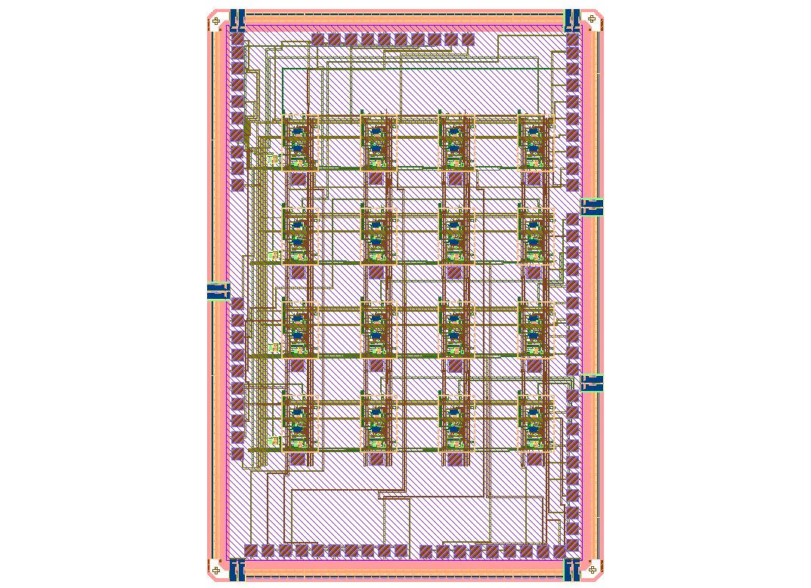

# Low-Current Readout Array for NIST Nanotechnology Accelerator Project

Custom integrated circuit developed for ultra-low current sensing applications in the NIST Nanotechnology Accelerator Project.

## SkyWater 130nm Tapeout Completed

## Project Overview

Designed a multi-channel low-current readout array in SkyWater 130-nm CMOS technology for precision current measurement and nanoscale sensing applications.
This design contains a mixed-signal readout array and a Bioinformatics Processing Unit that:

Amplifies the pico-ampere-range current signals
Filters high frequecy contents
Samples the analog input
Digitizes the samples with SAR ADCs
Stores the digital data in a memory
Read the memory and analyse the data to identify the DNA sequence
In order to test an on-chip circuits will be defined to generate the pico-ampere currents. Also a timing technique will be used to seperate the digital and anlaog circuity opertion time.

## Key Highlights

- Multi-channel readout array architecture
- Ultra-low current sensing capability
- Analog front-end circuit design
- Custom IC implementation
- Full physical layout
- Tapeout completed

## Responsibilities

- System architecture
- Schematic design
- Layout implementation
- Verification
- Tapeout preparation

## Technology

SkyWater 130nm CMOS

## Tools

Open source tools: Xscheme | Magic | Ngspice | Klayout
